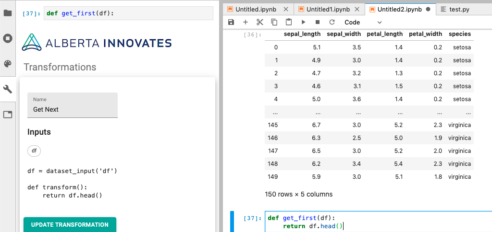

# Synthi

A JupyterLab extension to interact with the Synthi platform

## Prerequisites

* JupyterLab

## Installation

```bash
jupyter labextension install synthi
```

To install the development version (if you just want to use it),
[download and unzip the latest jupyterlab-synthi code](https://github.com/cybera/jupyterlab-synthi/archive/master.zip)
and then:

```bash
cd /unzipped-folder/synthi
jupyter labextension install .
```

You'll need to restart jupyter lab (`jupyter lab` on the command line) and refresh
your browser to get the new plugin.

## Configuration

You need to set an endpoint, an apiKey, and an organization for this plugin.
You can do that via: `Settings`=>`Advanced Settings Editor` in the menu. Then
select `Synthi` and set the following under "User Preferences":

```json
{
    "endpoint": "https://<your_url>/graphql",
    "apiKey": "your-api-key",
    "organization": "your-org-name"
}
```

## What it looks like

If you have everything setup correctly, you should be able to see transformation
inspectors for any notebook cell with a python method defined in it:



Note that it only shows up when the tab marked with the  icon is selected.

## Development

For a development install (requires npm version 4 or later), do the following in the repository directory:

```bash
jlpm install
jlpm run build
jupyter labextension link .
```

When running JupyterLab, you'll likely want to do the following:

```bash
jupyter lab --watch --no-browser
```

This will cause JupyterLab to automatically pick up changes when you run `jlpm run build` on this package
without having to rebuild. You still actually have to run `jlpm run build` and refresh the browser to see
changes, which isn't quite as nice a React development experience as a regular project, but it's better
than waiting for JupyterLab to rebuild all the time. The `--no-browser` flag just keeps JupyterLab from
opening up a new browser when you do need to restart it (if you install new package dependencies
`jlpm add pkgname`, you'll need to restart).

To rebuild the package and the JupyterLab app:

```bash
jlpm run build
jupyter lab build
```
